# Linux Virtual Network Lab: Secure Services & Traffic Analysis

This is my second practical cybersecurity project.
I built a small Linux network using VirtualBox, with one server and one client.
On the server, I configured services (Apache, SSH, Samba, DHCP), secured them with UFW/iptables, and used Wireshark from the client to analyze plaintext vs encrypted traffic.

---

## Network Setup

* **Server (Ubuntu)** → `192.168.56.100`
* **Client (Ubuntu)** → `192.168.56.102`
* **Network mode** → Internal Network (VirtualBox)
* **Gateway** → `10.0.3.2` (VirtualBox NAT adapter for internet access)

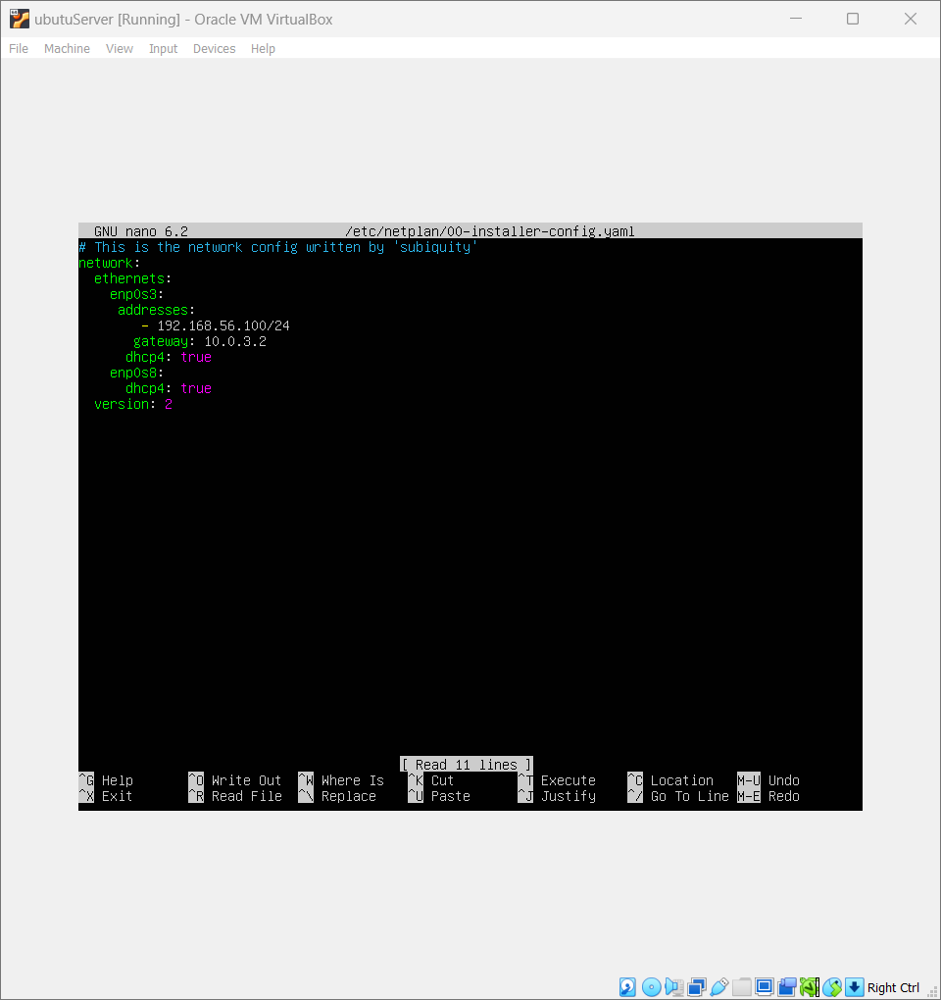
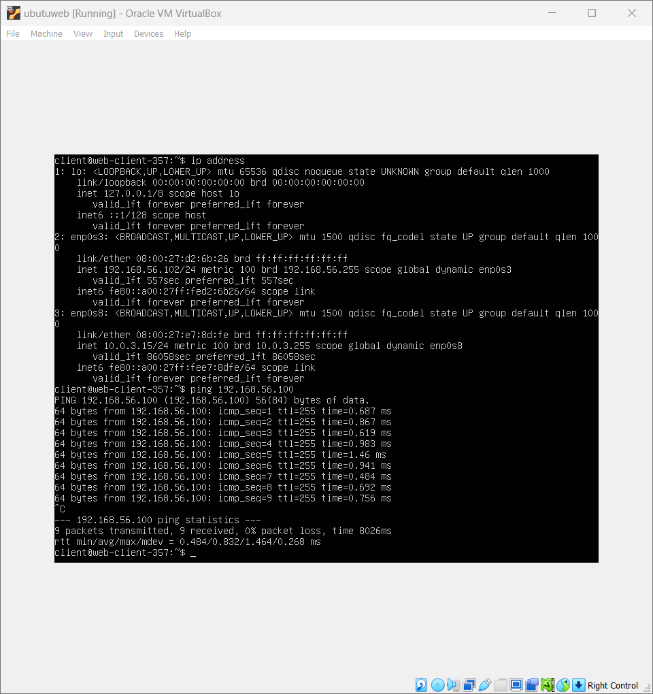
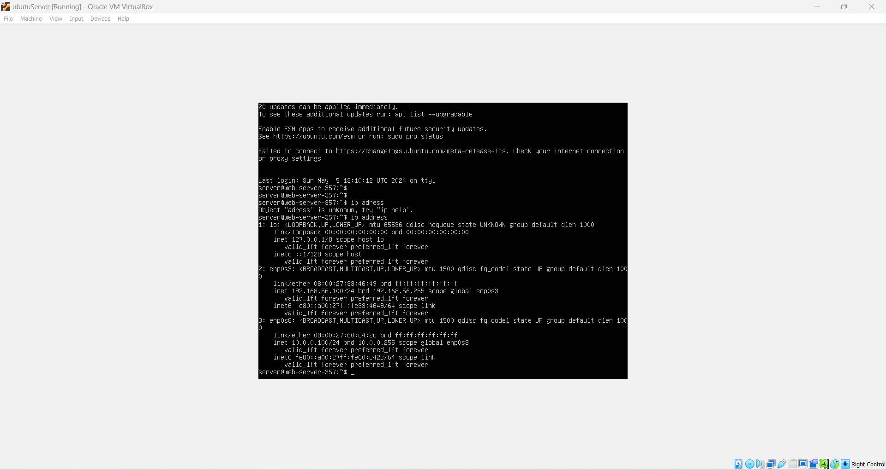

---

## Apache (HTTP) and SSH (Encrypted)

On the server (`192.168.56.100`):

```bash
sudo apt install apache2 -y
sudo apt install openssh-server -y
```

I tested Apache HTTP directly from my host machine’s browser,
while SSH access was tested using PuTTY to connect to the Ubuntu server.


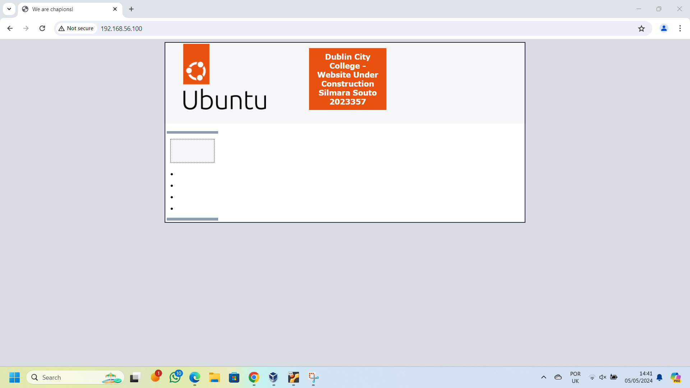
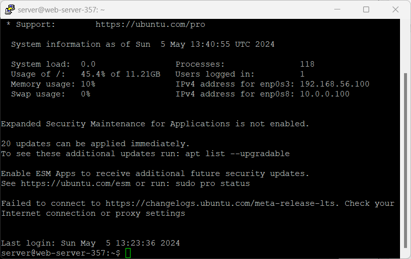

---

## Wireshark Traffic Analysis

This demonstrated how insecure services like HTTP can expose sensitive information, while SSH encrypted the traffic, making it unreadable in Wireshark.

* Captured HTTP traffic → credentials and content visible in plaintext.
* Captured SSH traffic → encrypted packets, no readable content.

 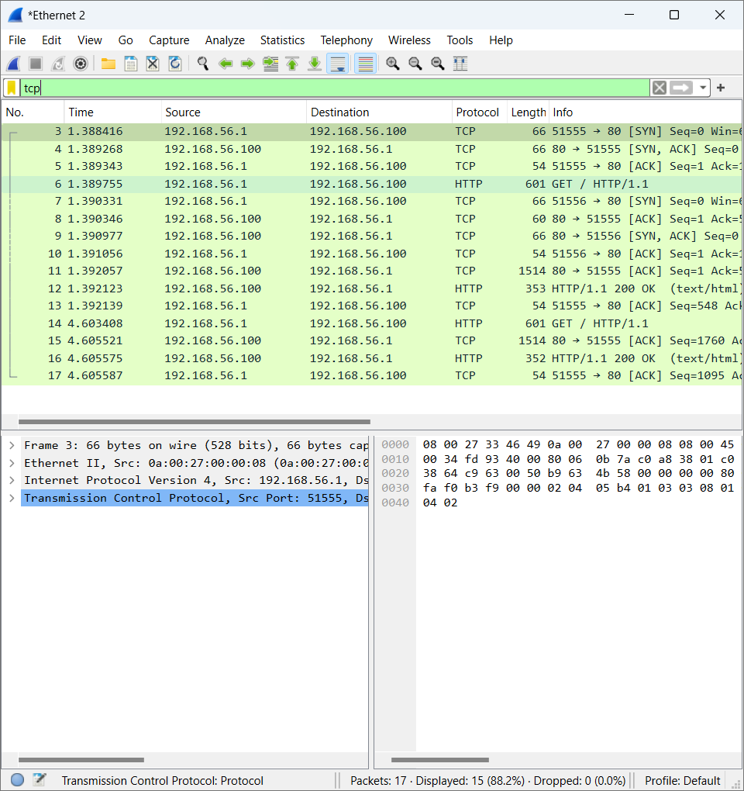
 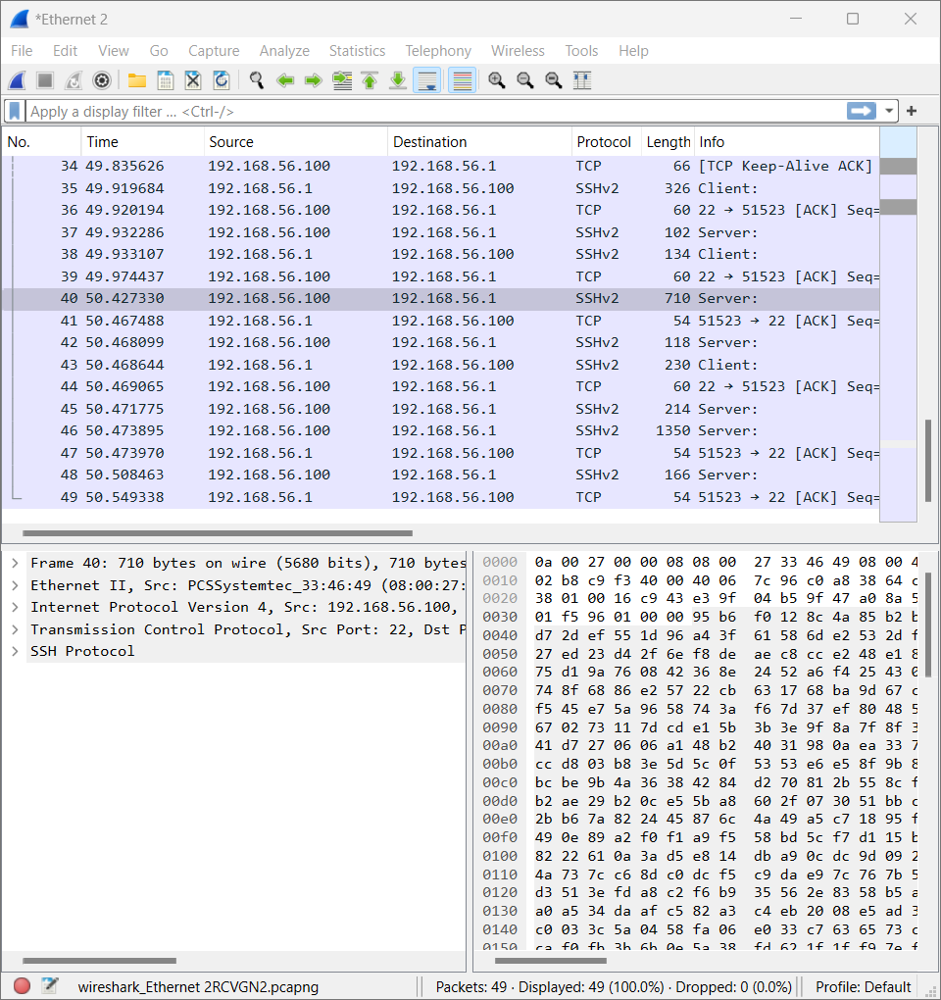

---

## Samba File Sharing

On the server:

```bash
sudo apt install samba -y
sudo nano /etc/samba/smb.conf
```

Configured a shared directory with restricted access.

Using my host to check the Samba-folder:

   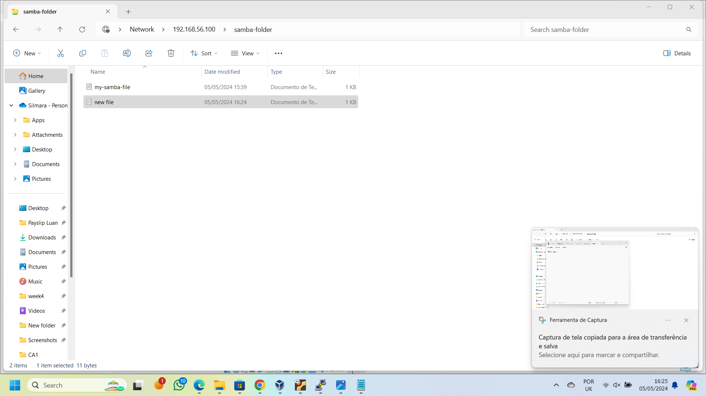
   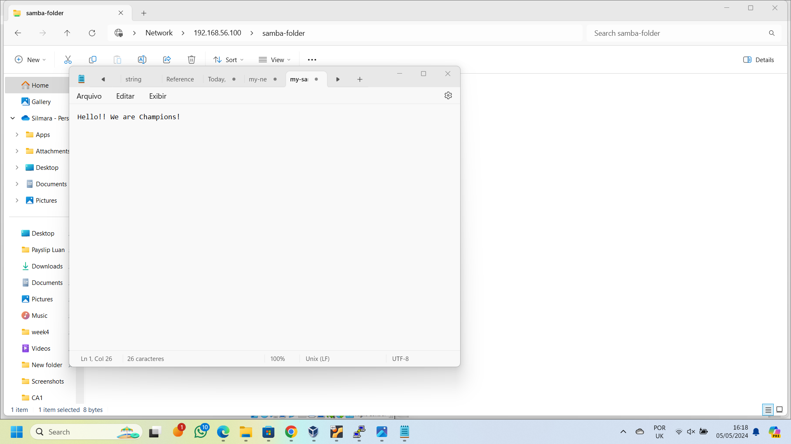
   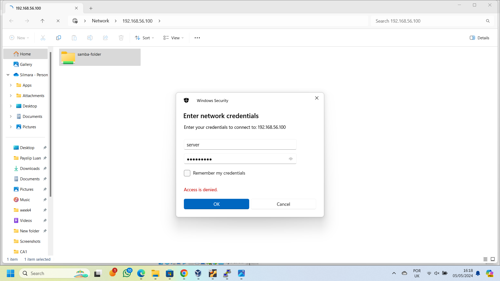                        
                            

---

## Firewall with UFW / iptables

I used UFW for quick firewall rule management and iptables directly to demonstrate granular packet filtering

On the server:

```bash
sudo ufw allow 22/tcp
sudo ufw deny 80/tcp
sudo ufw enable
sudo ufw status
```

 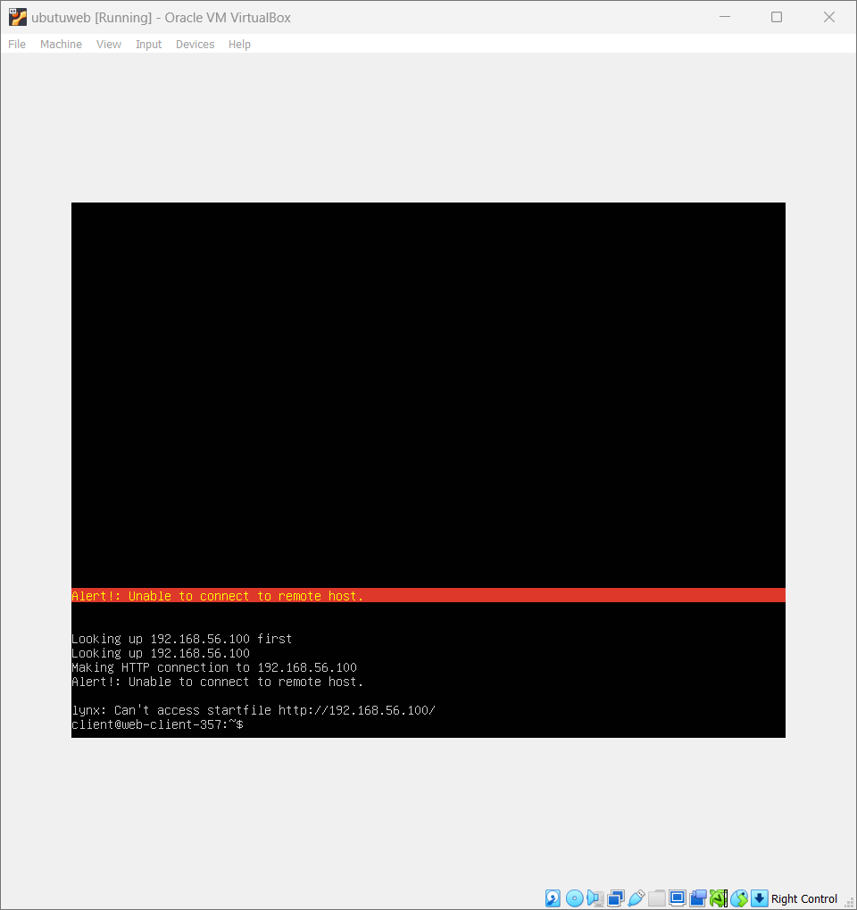
 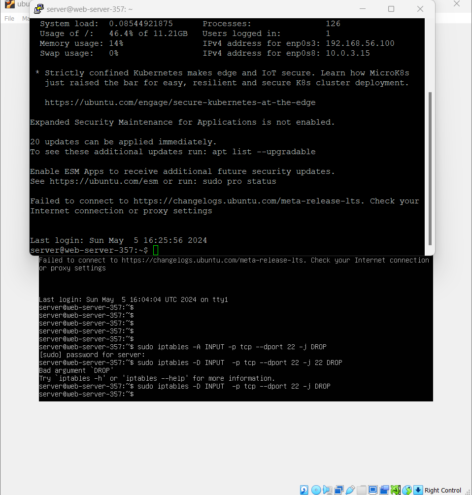                        
                           

---

## Containers (Bonus)

On the server:

```bash
sudo apt install docker.io -y
sudo systemctl enable --now docker
sudo docker run hello-world
```

➡️ 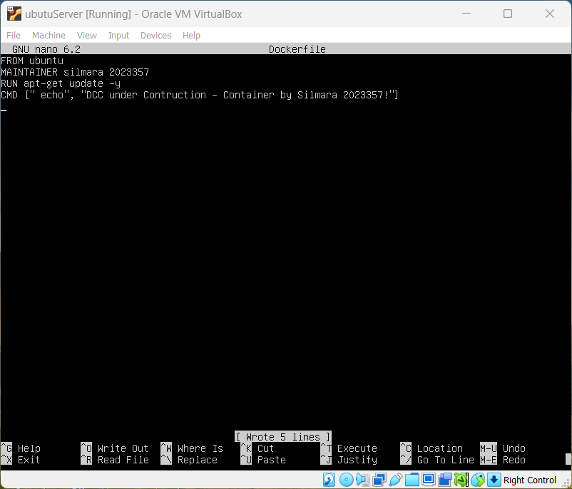

---

## Key Takeaways

* Saw the difference between plaintext HTTP and encrypted SSH traffic.
* Used firewall rules (UFW/iptables) to control which services are exposed.
* Configured Samba with access control.
* Practiced setting static IPs and running services inside a virtual network.
* First steps with Docker for container isolation.

---

## Next Steps

* Replace HTTP with HTTPS (TLS certificates).
* Add fail2ban to protect SSH from brute force.
* Strengthen Samba authentication.
* Deploy multiple containers with Docker Compose.

---

## Conclusion

This project complemented my first firewall lab.
I went from securing a single host to building a small Linux network with multiple services, securing them with firewall rules, and validating traffic with Wireshark.
It gave me hands-on experience in **defense in depth**: services, network, and encryption.
